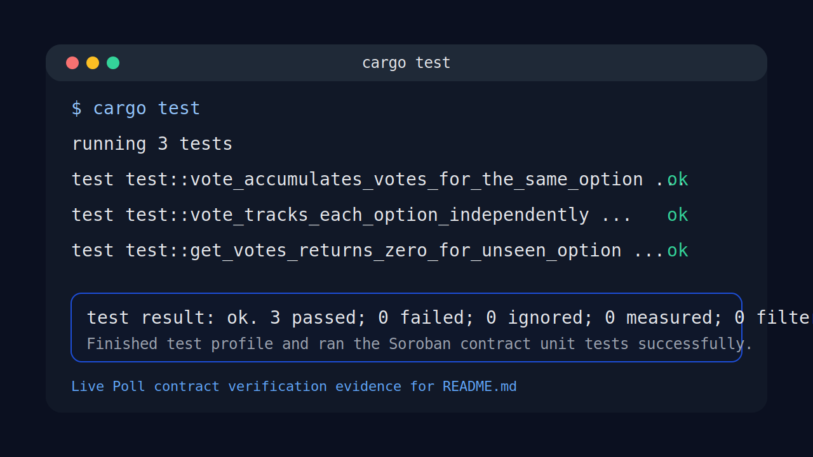
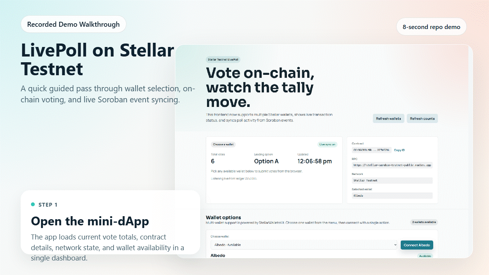

# Live Poll on Stellar Testnet

One-question mini-dApp built with a Soroban smart contract and a React frontend.

## Project Links

- Public GitHub repository: [github.com/rahul7686/LivePoll-Adv](https://github.com/rahul7686/LivePoll-Adv)
- Live demo link: [live-poll-adv.vercel.app](https://live-poll-adv.vercel.app/)
- Vercel config: [`vercel.json`](./vercel.json)

## Submission Checklist

- Mini-dApp fully functional: the frontend reads live totals, connects to multiple Stellar wallets, submits on-chain votes, shows pending, success, and failure transaction states, and syncs tallies from Soroban events.
- Minimum 3 tests passing: `cargo test` passes 3 Soroban contract tests.
- README complete: setup, usage, verification, deployed contract evidence, live demo link, screenshots, and commit evidence are all included here.
- Minimum 3+ meaningful commits: the git history exceeds the requirement.
- Demo video link is included below alongside the existing visual walkthrough assets.

## Features

- Multi-wallet support through `StellarWalletsKit`
- Soroban contract reads and writes from the React app
- Live vote synchronization from contract events
- Loading states for wallet detection, vote refresh, and transaction progress
- Basic vote caching with `localStorage` so the last known totals and timestamp survive refreshes
- Explicit transaction phases: `idle`, `pending`, `success`, and `failed`
- Handled wallet and transaction errors for wallet missing, user rejection, and insufficient balance
- Persistent manual wallet disconnect across page refresh
- Draw detection when both options are tied

## Project Structure

- `live-poll-contract/` - Soroban contract workspace
- `live-poll-website/` - React + Vite frontend
- `docs/` - submission evidence, screenshots, and demo assets

## Live Demo

- Vercel production URL: [live-poll-adv.vercel.app](https://live-poll-adv.vercel.app/)
- If the URL is not live yet, redeploy the latest `main` commit from Vercel.

## Deployed Contract

- Contract ID: `CC43GCB3LMRLKQ6JFJCPNT2QJXVOK73Y5HWAF7RZAYIMRL322I7WIZ6L`
- Deploy transaction hash: `d7a8f8f378e8813c45db34e28e0721c11758c990564fe6864eb61753edfbf418`
- Deploy transaction: `https://stellar.expert/explorer/testnet/tx/d7a8f8f378e8813c45db34e28e0721c11758c990564fe6864eb61753edfbf418`
- Verified contract call hash: `3c9004799722dc8dc79781602aef11f4e987b843d9d185183f45a478826f49dc`
- Verified contract call transaction: `https://stellar.expert/explorer/testnet/tx/3c9004799722dc8dc79781602aef11f4e987b843d9d185183f45a478826f49dc`

## Screenshot


## Test Output Screenshot



## Recorded Demo

- Demo video: [Google Drive recording](https://drive.google.com/file/d/1UR3PWTMgjcDsVdP7BnRU-rHqyRAdyuBA/view?usp=sharing)
- Local MP4 asset: [`docs/live-poll-demo.mp4`](./docs/live-poll-demo.mp4)
- Recorded walkthrough: [`docs/live-poll-demo.gif`](./docs/live-poll-demo.gif)
- Demo storyboard source: [`docs/demo-video.html`](./docs/demo-video.html)

<p align="center">
  
</p>

## Local Setup

### Frontend

```powershell
cd live-poll-website
npm install
npm run dev
```

If PowerShell blocks `npm.ps1`, use `npm.cmd install` and `npm.cmd run dev` instead.

For local development, open `https://localhost:5173/` and accept the local HTTPS warning once if your browser asks.

### Wallet

Use any detected Stellar wallet shown in the app and switch it to Testnet before voting.

### Contract

The frontend is already pinned to the deployed contract ID above. Rebuilding or redeploying is only needed if you change the contract code.

```powershell
cd live-poll-contract
cargo build --target wasm32v1-none --release
```

## How To Use

1. Open the app at [live-poll-adv.vercel.app](https://live-poll-adv.vercel.app/)
2. Refresh detected wallets if needed
3. Choose an available wallet and connect it
4. Confirm the wallet is on Stellar Testnet
5. Vote for `Option A` or `Option B`
6. Watch the transaction status, cached totals, and live activity panels update

## Smart Contract Functions

- `vote(option: Symbol)` increments the selected option count and emits a `voted` event
- `get_votes(option: Symbol)` reads the current total for an option

## Tests

The passing contract tests are:

- `get_votes_returns_zero_for_unseen_option`
- `vote_accumulates_votes_for_the_same_option`
- `vote_tracks_each_option_independently`

## Verification

```powershell
cd live-poll-contract
cargo test

cd ../live-poll-website
npm.cmd run lint
npm.cmd run build
```

## Deployment

- Vercel can deploy this repo from the repository root using [`vercel.json`](./vercel.json).
- Recommended Vercel settings: Framework Preset `Vite`, Root Directory `.`, Install Command `cd live-poll-website && npm ci`, Build Command `cd live-poll-website && npm run build`, Output Directory `live-poll-website/dist`, Production Branch `main`.
- Remove `VITE_BASE_PATH` from the Vercel project environment if it exists.
- Use the public production domain such as `live-poll-adv.vercel.app` for sharing and README links, not the protected generated preview URL that contains `git-main`.
- After saving the settings, redeploy the latest `main` commit.

## Key Files

- Contract: `live-poll-contract/contracts/hello-world/src/lib.rs`
- Contract tests: `live-poll-contract/contracts/hello-world/src/test.rs`
- Frontend app: `live-poll-website/src/App.jsx`
- Frontend styles: `live-poll-website/src/App.css`
- Contract client helpers: `live-poll-website/src/lib/pollClient.js`
- Wallet integration: `live-poll-website/src/lib/walletKit.js`
- Vercel deployment config: `vercel.json`

## Commit History

This repo already satisfies the 3+ meaningful commits requirement. Recent examples include:

- `feat: add multi-wallet live poll dapp`
- `feat: add soroban poll contract`
- `feat: add multi-wallet support with StellarWalletsKit`
- `fix: persist manual wallet disconnects`
- `fix: stabilize Vite contract client exports`
- `fix: show draw for tied poll leaders`
