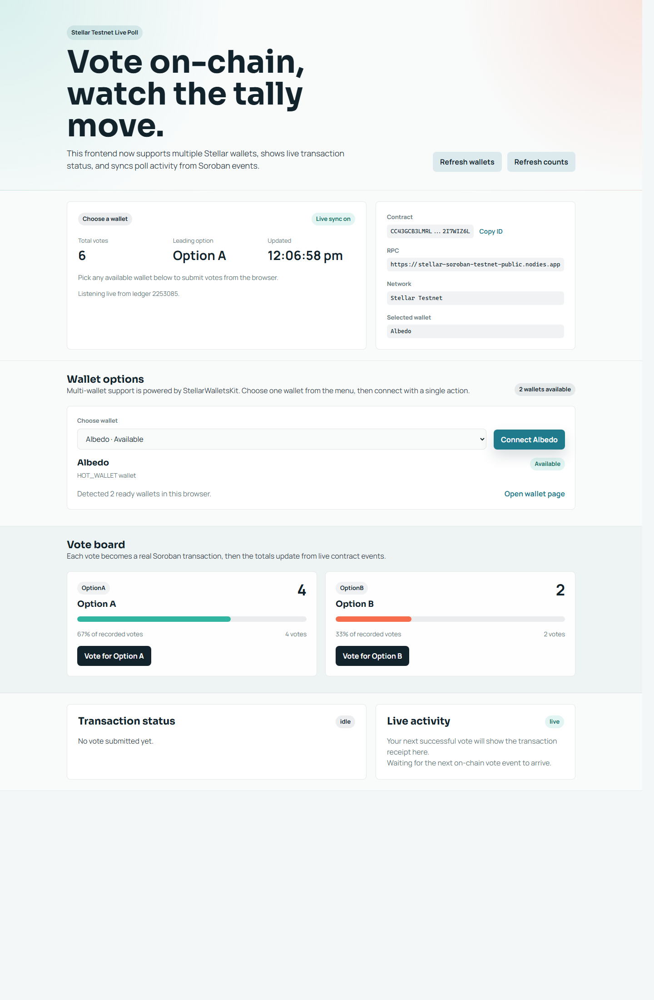

# Live Poll on Stellar Testnet

One-question live poll built with a Soroban smart contract and a React frontend.

## Overview

This project satisfies the Level 2 live poll idea with:

- multi-wallet support using `StellarWalletsKit`
- contract reads and writes from the frontend
- explicit transaction status states: pending, success, and fail
- three handled wallet/transaction errors:
  - wallet not found
  - user rejected request
  - insufficient balance
- live vote synchronization from Soroban contract events

## Project Structure

- `live-poll-contract/` - Soroban contract workspace
- `live-poll-website/` - React + Vite frontend

## Deployed Contract

- Contract ID: `CC43GCB3LMRLKQ6JFJCPNT2QJXVOK73Y5HWAF7RZAYIMRL322I7WIZ6L`
- Deploy transaction hash:
  `d7a8f8f378e8813c45db34e28e0721c11758c990564fe6864eb61753edfbf418`
- Deploy transaction:
  `https://stellar.expert/explorer/testnet/tx/d7a8f8f378e8813c45db34e28e0721c11758c990564fe6864eb61753edfbf418`
- Verified contract call hash:
  `3c9004799722dc8dc79781602aef11f4e987b843d9d185183f45a478826f49dc`
- Verified contract call transaction:
  `https://stellar.expert/explorer/testnet/tx/3c9004799722dc8dc79781602aef11f4e987b843d9d185183f45a478826f49dc`

## Live Demo Link

Optional public deployment: not deployed yet. Local HTTPS dev server runs at `https://localhost:5173/`.

## Wallet Selector Screenshot



## Local Setup

### Frontend

```powershell
cd live-poll-website
npm install
npm run dev
```

Open `https://localhost:5173/` and accept the local HTTPS warning once if your browser asks.
The Vite scripts use the native config loader so the app builds cleanly in this Windows + OneDrive workspace.

### Wallet

Use any available Stellar wallet shown in the app and switch it to Testnet before voting.
The wallet chooser uses one selector and one connect button so people can quickly switch between detected wallets.

### Contract

The frontend is already pinned to the deployed contract ID above. Rebuilding or redeploying is only needed if you change the contract code.

If you want to rebuild the contract locally:

```powershell
cd live-poll-contract
cargo build --target wasm32v1-none --release
```

## How To Use

1. Open the app at `https://localhost:5173/`
2. Choose an available wallet from the wallet selector
3. Connect the wallet and confirm it is on Testnet
4. Vote for `Option A` or `Option B`
5. Watch the transaction status panel and the live event sync panel update

## Smart Contract Functions

- `vote(option: Symbol)` - increments the selected option count and emits a `voted` event
- `get_votes(option: Symbol)` - reads the current total for an option

## Key Files

- Contract: `live-poll-contract/contracts/hello-world/src/lib.rs`
- Frontend app: `live-poll-website/src/App.jsx`
- Contract client helpers: `live-poll-website/src/lib/pollClient.js`
- Wallet integration: `live-poll-website/src/lib/walletKit.js`

## Verification

```powershell
cd live-poll-contract
cargo test

cd ../live-poll-website
npm run lint
npm run build
```

## Submission Notes

- Public GitHub repository: create after pushing this workspace
- Minimum 2 meaningful commits: prepared locally in this repo history
- README includes:
  - setup instructions
  - wallet selector screenshot
  - deployed contract address
  - verifiable contract call transaction hash
